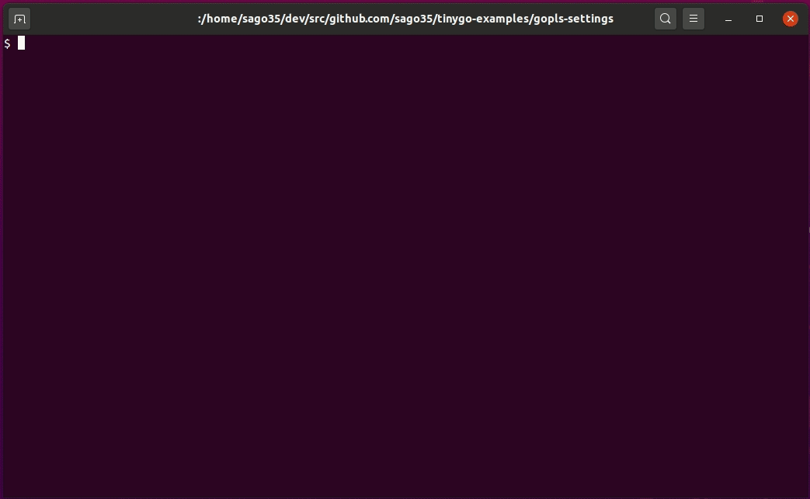
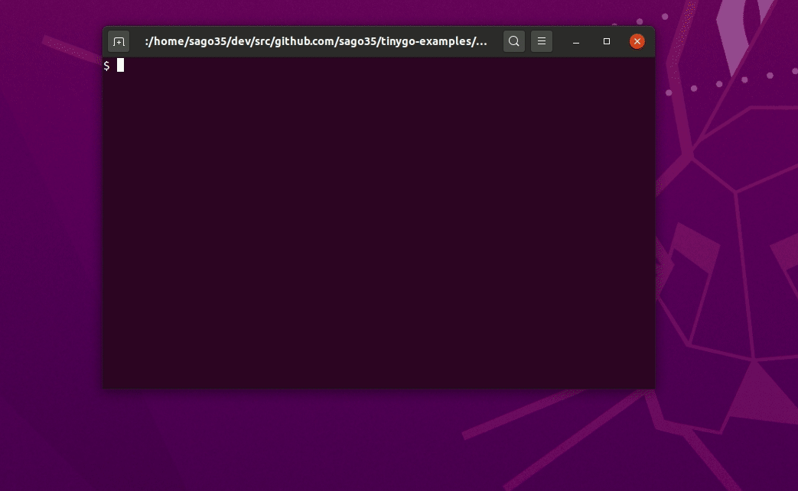

# tinygo-edit

Add an environment variable for tinygo and open the editor.  
Using tinygo-edit, you can easily integrate with gopls.  

## Description

### Vim



### VSCode



* https://dev.to/sago35/tinygo-vim-gopls-48h1

### Bash/ZSH Shell Completion

By default, all flags and commands/subcommands generate completions internally.  
You can enable autocompletion by setting the following to `~/.bashrc` etc.  

```
$ eval "$(tinygo-edit --completion-script-bash)"
```

Or for ZSH

```
$ eval "$(tinygo-edit --completion-script-zsh)"
```

* https://github.com/alecthomas/kingpin#bashzsh-shell-completion

## Usage

```
usage: tinygo-edit [<flags>]

This program uses $TINYGOPATH

  export TINYGOPATH=/path/to/tinygo-root-directory

You can use the following environment variables

  To get a list of targets from the result of 'tinygo targets':
    export TINYGO_EDIT_WITH_GOROOT=1
  To disable this feature:
    export TINYGO_EDIT_WITH_GOROOT=0

  Using the GOROOT environment variable to link with gopls:
    export TINYGO_EDIT_WITH_TINYGO_TARGETS=1

Flags:
  -h, --help           Show context-sensitive help (also try --help-long and
                       --help-man).
      --editor="vim"   editor path
      --wait           wait for the editor to close
      --with-goroot    use proper GOROOT
      --target=TARGET  target name
      --version        Show application version.
```

This program uses $TINYGOPATH, so set it up.  

```
# bash
$ export TINYGOPATH=/path/to/your/tinygo

$ windows cmd.exe
$ set TINYGOPATH=C:\path\to\your\tinygo
```

Now you can use tinygo-edit.

```
# Vim
$ tinygo-edit --target xiao --editor vim --wait

# gVim
$ tinygo-edit --target xiao --editor gvim

# VSCode
$ tinygo-edit --target xiao --editor code
```

If it doesn't work, please try the following  

1. Remove go.mod in the current dir
2. If $TINYGOPATH/go.mod exists, delete it.
3. Restart tinygo-edit.

If you don't want to remove the go.mod, try the following page  

* https://github.com/tinygo-org/tinygo-site/pull/107
  * https://deploy-preview-107--tinygo.netlify.app/ide-integration/

## Usage (--with-goroot)

This option is currently set to 1 by default.  
If you want to use TinyGo older than 0.15, you can disable it with the following  

```
$ tinygo-edit --no-with-goroot --target xiao --editor code
```

Since the dev branch ([de3ffe0af75305e354bfb3dadbba543809f3d8d5](https://github.com/tinygo-org/tinygo/tree/de3ffe0af75305e354bfb3dadbba543809f3d8d5)), GOROOT has been added to tinygo info.  
You can use this parameter for very simple completion.  
To do this with tinygo-edit, use the --with-goroot option.  

It works with or without go.mod, so you can work with gopls very simply.  

```
# Vim
$ tinygo-edit --with-goroot --target xiao --editor vim --wait

# gVim
$ tinygo-edit --with-goroot --target xiao --editor gvim

# VSCode
$ tinygo-edit --with-goroot --target xiao --editor code
```


## Installation

```
$ go get github.com/sago35/tinygo-edit
```

## Build

```
$ go build
```

### Environment

* go
* kingpin.v2
* tinygo 0.15

## FAQ

### I can't "tinygo build" in a vim opened by tinygo-edit.

If you are using `TINYGO_EDIT_WITH_GOROOT` or `--with-goroot`,  
you can use the `unset GOROOT` command, which will allow you to build.

## Author

sago35 - <sago35@gmail.com>
